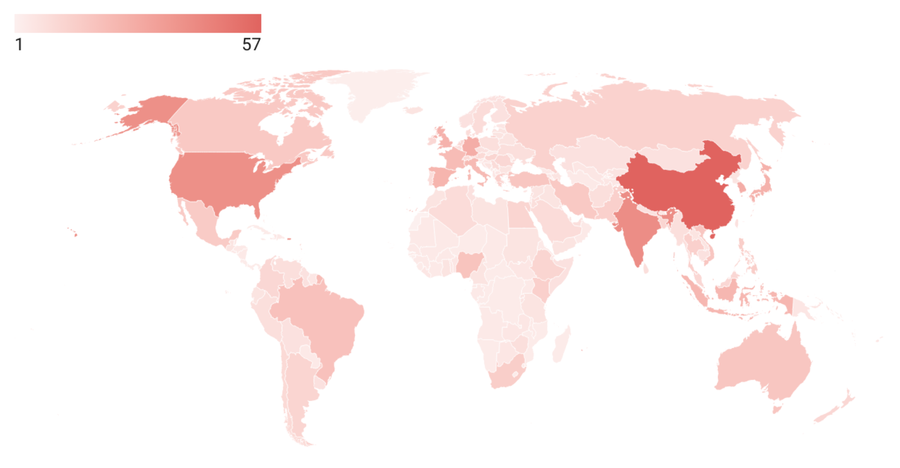
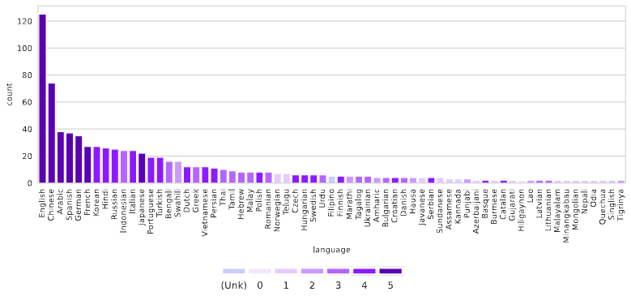

# Survey of Cultural Awareness in Language Models: Text and Beyond
## (Being Updated)

> **[Survey of Cultural Awareness in Language Models: Text and Beyond](https://arxiv.org/abs/2411.00860)**

> *Siddhesh Pawar<sup>2*</sup>, Junyeong Park<sup>1*</sup>, Jiho Jin<sup>1</sup>, Arnav Arora<sup>2</sup>, Junho Myung<sup>1</sup>, Srishti Yadav<sup>2</sup>, Faiz Ghifari Haznitrama<sup>1</sup>, Inhwa Song<sup>1</sup>, Alice Oh<sup>1</sup>, Isabelle Augenstein<sup>2</sup>*

> *KAIST<sup>1</sup>, University of Copenhagen<sup>2</sup>*

```
@misc{pawar2024surveyculturalawarenesslanguage,
      title={Survey of Cultural Awareness in Language Models: Text and Beyond}, 
      author={Siddhesh Pawar and Junyeong Park and Jiho Jin and Arnav Arora and Junho Myung and Srishti Yadav and Faiz Ghifari Haznitrama and Inhwa Song and Alice Oh and Isabelle Augenstein},
      year={2024},
      eprint={2411.00860},
      archivePrefix={arXiv},
      primaryClass={cs.CL},
      url={https://arxiv.org/abs/2411.00860}, 
}
```

# About
Large-scale deployment of large language models (LLMs) in various applications, such as chatbots and virtual assistants, requires LLMs to be culturally sensitive to the user to ensure inclusivity. Culture has been widely studied in psychology and anthropology, and there has been a recent surge in research on making LLMs more culturally inclusive in LLMs that goes beyond multilinguality and builds on findings from psychology and anthropology.  In this paper, we survey efforts towards incorporating cultural awareness into text-based and multimodal LLMs. We start by defining cultural awareness in LLMs, taking the definitions of culture from anthropology and psychology as a point of departure. We then examine methodologies adopted for creating cross-cultural datasets, strategies for cultural inclusion in downstream tasks, and methodologies that have been used for benchmarking cultural awareness in LLMs. Further, we discuss the ethical implications of cultural alignment, the role of Human-Computer Interaction in driving cultural inclusion in LLMs, and the role of cultural alignment in driving social science research. We finally provide pointers to future research based on our findings about gaps in the literature.


# 🌎 Language and Region Coverage



Fig 1 presents the frequency distribution of languages used in the evaluations, showing only languages with a frequency of two or more. The colors indicate the language resource classes, with darker colors (with higher numbers) representing higher-resource languages. most studies collect data in English. Chinese, Spanish, and German are other high-resource languages observed frequently in cultural studies. Notably, for most languages classified as level 2 or below, there are at most seven studies, with the only exception of Swahili, underscoring the gap in research.

Fig 2 visualize the region distribution at the country level, including only countries explicitly mentioned by the authors in their manuscripts. Most of the studies focus on WEIRD (Western, Educated, Industrialized, Rich,
and Democratic) countries, along with regions such as East Asia, Indonesia, and India. In contrast, countries in Africa, Central and South America, Eastern Europe, and Central Asia are significantly underrepresented.

Please check out the details in the paper[[Link]](https://arxiv.org/abs/2411.00860).


# 📁 Table of Content
- [Survey of Cultural Awareness in Language Models: Text and Beyond](#survey-of-cultural-awareness-in-language-models-text-and-beyond)
  - [(Being Updated)](#being-updated)
- [About](#about)
- [🌎 Language and Region Coverage](#-language-and-region-coverage)
- [📁 Table of Content](#-table-of-content)
- [💬 Language Models and Culture](#-language-models-and-culture)
  - [Cultural Alignment: Methodologies and Goals](#cultural-alignment-methodologies-and-goals)
    - [Training-Based Methods](#training-based-methods)
      - [Pre-training](#pre-training)
      - [Fine-tuning](#fine-tuning)
      - [Others](#others)
    - [Training-Free Methods](#training-free-methods)
    - [Goal-Specific Alignment Strategies](#goal-specific-alignment-strategies)
  - [Benchmarks and Evaluation](#benchmarks-and-evaluation)
    - [Academic Knowledge](#academic-knowledge)
    - [Commonsense Knowledge](#commonsense-knowledge)
      - [Culture-Specific](#culture-specific)
      - [Multiculture Monolingual](#multiculture-monolingual)
      - [Multiculture Multilingual](#multiculture-multilingual)
    - [Social Values](#social-values)
    - [Social Norms and Morals](#social-norms-and-morals)
    - [Social Bias and Stereotype](#social-bias-and-stereotype)
    - [Toxicity and Safety](#toxicity-and-safety)
    - [Emotional and Subjective Topics](#emotional-and-subjective-topics)
    - [Linguistics](#linguistics)
      - [Language Properties](#language-properties)
      - [Linguistic Varieties](#linguistic-varieties)
      - [Literary Forms](#literary-forms)
      - [Culturally-Adapted Translation](#culturally-adapted-translation)
      - [Culturally-Adapted Dialogue Systems](#culturally-adapted-dialogue-systems)
- [🖼️ Vision Models and Culture](#️-vision-models-and-culture)
  - [Language Output Tasks](#language-output-tasks)
  - [Image Output Tasks](#image-output-tasks)
  - [Art Forms Related Tasks](#art-forms-related-tasks)
  - [Miscellaneous Tasks](#miscellaneous-tasks)
- [🎞️ Other Modalities and Culture](#️-other-modalities-and-culture)
  - [Audio and Speech](#audio-and-speech)
  - [Video](#video)


# 💬 Language Models and Culture
## Cultural Alignment: Methodologies and Goals
### Training-Based Methods
#### Pre-training
- HyperCLOVA X Technical Report, <ins>arXiv, 2024</ins> [[Paper](https://arxiv.org/abs/2404.01954)] [[Code](https://www.ncloud.com/product/aiService/clovaStudio)]
- PersianLLaMA: Towards Building First Persian Large Language Model, <ins>arXiv, 2023</ins> [[Paper](https://arxiv.org/abs/2312.15713)] [[Code](https://huggingface.co/ViraIntelligentDataMining/PersianLLaMA-13B)]
- JASMINE: Arabic GPT Models for Few-Shot Learning, <ins>EMNLP, 2023</ins> [[Paper](https://aclanthology.org/2023.emnlp-main.1040/)] [[Code](https://huggingface.co/UBC-NLP/Jasmine-350M)]
- UCCIX: Irish-eXcellence Large Language Model, <ins>arXiv, 2024</ins> [[Paper](https://arxiv.org/abs/2405.13010)] [[Code](https://huggingface.co/ReliableAI/UCCIX-Llama2-13B)]
- SeaLLMs -- Large Language Models for Southeast Asia, <ins>ACL DEMO, 2024</ins> [[Paper](https://arxiv.org/abs/2312.00738)] [[Code](https://damo-nlp-sg.github.io/SeaLLMs/)]
- Taiwan LLM: Bridging the Linguistic Divide with a Culturally Aligned Language Model, <ins>arXiv, 2023</ins> [[Paper](https://arxiv.org/abs/2311.17487)] [[Code](https://github.com/MiuLab/Taiwan-LLM)]
- Komodo: A Linguistic Expedition into Indonesia's Regional Languages, <ins>arXiv, 2024</ins> [[Paper](https://arxiv.org/abs/2403.09362)] [[Code](https://huggingface.co/Yellow-AI-NLP/komodo-7b-base)]
- Typhoon: Thai Large Language Models, <ins>arXiv, 2023</ins> [[Paper](https://arxiv.org/abs/2312.13951)] [[Code](https://huggingface.co/scb10x/typhoon-7b)]
- Sabiá: Portuguese Large Language Models, <ins>arXiv, 2023</ins> [[Paper](https://arxiv.org/abs/2304.07880)] [[Code](https://huggingface.co/maritaca-ai/sabia-7b)]
- AceGPT, Localizing Large Language Models in Arabic, <ins>NAACL, 2024</ins> [[Paper](https://aclanthology.org/2024.naacl-long.450/)] [[Code](https://github.com/FreedomIntelligence/AceGPT)]
- Jais and Jais-chat: Arabic-Centric Foundation and Instruction-Tuned Open Generative Large Language Models, <ins>arXiv, 2023</ins> [[Paper](https://arxiv.org/abs/2308.16149)] [[Code](https://huggingface.co/inceptionai/jais-13b-chat)]
- EthioLLM: Multilingual Large Language Models for Ethiopian Languages with Task Evaluation, <ins>LREC | COLING, 2024</ins> [[Paper](https://aclanthology.org/2024.lrec-main.561/)] [[Code](https://huggingface.co/EthioNLP)]
- "Vorbeşti Româneşte?" A Recipe to Train Powerful Romanian LLMs with English Instructions, <ins>EMNLP Findings, 2024</ins> [[Paper](https://arxiv.org/abs/2406.18266)] [[Code](https://huggingface.co/OpenLLM-Ro)]
- BertaQA: How Much Do Language Models Know About Local Culture?, <ins>arXiv, 2024</ins> [[Paper](https://arxiv.org/abs/2406.07302)] [[Code](https://github.com/juletx/BertaQA)]

#### Fine-tuning
- Cendol: Open Instruction-tuned Generative Large Language Models for Indonesian Languages, <ins>arXiv, 2024</ins> [[Paper](https://arxiv.org/abs/2404.06138)] [[Code](https://huggingface.co/indonlp/cendol)]
- COIG-CQIA: Quality is All You Need for Chinese Instruction Fine-tuning, <ins>arXiv, 2024</ins> [[Paper](https://arxiv.org/abs/2403.18058)] [[Code](https://huggingface.co/datasets/m-a-p/COIG-CQIA)]
- CRAFT: Extracting and Tuning Cultural Instructions from the Wild, <ins>C3NLP Workshop, 2024</ins> [[Paper](https://arxiv.org/abs/2405.03138)] [[Code](https://github.com/SeaEval/CRAFT)]
- CulturePark: Boosting Cross-cultural Understanding in Large Language Models, <ins>NeurIPS, 2024</ins> [[Paper](https://arxiv.org/abs/2405.15145)] [[Code](https://github.com/Scarelette/CulturePark)]
- CultureLLM: Incorporating Cultural Differences into Large Language Models, <ins>NeurIPS, 2024</ins> [[Paper](https://arxiv.org/abs/2402.10946)] [[Code](https://github.com/Scarelette/CultureLLM)]
- CultureBank: An Online Community-Driven Knowledge Base Towards Culturally Aware Language Technologies, <ins>arXiv, 2024</ins> [[Paper](paper_link)] [[Code](https://huggingface.co/datasets/SALT-NLP/CultureBank)]
- Methodology of Adapting Large English Language Models for Specific Cultural Contexts, <ins>arXiv, 2024</ins> [[Paper](https://arxiv.org/abs/2406.18192)]
- GD-COMET: A Geo-Diverse Commonsense Inference Model, <ins>EMNLP, 2023</ins> [[Paper](https://aclanthology.org/2023.emnlp-main.496/)] [[Code](https://github.com/meharbhatia/GD-COMET)]
- Cultural Compass: Predicting Transfer Learning Success in Offensive Language Detection with Cultural Features, <ins>EMNLP Findings, 2023</ins> [[Paper](https://aclanthology.org/2023.findings-emnlp.845/)] [[Code](https://github.com/lizhou21/cultural-compass)]
- How Do Moral Emotions Shape Political Participation? A Cross-Cultural Analysis of Online Petitions Using Language Models, <ins>ACL Findings, 2024</ins> [[Paper](https://aclanthology.org/2024.findings-acl.963/)] [[Code](https://github.com/Paul-scpark/Moral-Emotion)]
- Social Norms-Grounded Machine Ethics in Complex Narrative Situation, <ins>COLING, 2022</ins> [[Paper](https://aclanthology.org/2022.coling-1.114/)]
- Multi-domain Hate Speech Detection Using Dual Contrastive Learning and Paralinguistic Features, <ins>LREC | COLING, 2024</ins> [[Paper](https://aclanthology.org/2024.lrec-main.1025/)]
- Generalizable Multilingual Hate Speech Detection on Low Resource Indian Languages using Fair Selection in Federated Learning, <ins>NAACL, 2024</ins> [[Paper](https://aclanthology.org/2024.naacl-long.400/)]


#### Others
- Modular Pluralism: Pluralistic Alignment via Multi-LLM Collaboration, <ins>EMNLP, 2024</ins> [[Paper](https://arxiv.org/abs/2406.15951)] [[Code](https://github.com/BunsenFeng/modular_pluralism/tree/main)]
- An Unsupervised Framework for Adaptive Context-aware Simplified-Traditional Chinese Character Conversion, <ins>LREC | COLING, 2024</ins> [[Paper](https://aclanthology.org/2024.lrec-main.118/)] [[Code](https://github.com/NLPInBLCU/STCC)]
- Does Cross-Cultural Alignment Change the Commonsense Morality of Language Models?, <ins>C3NLP Workshop, 2024</ins> [[Paper](https://aclanthology.org/2024.c3nlp-1.5/)]


### Training-Free Methods
- Investigating Cultural Alignment of Large Language Models, <ins>ACL, 2024</ins> [[Paper](https://arxiv.org/abs/2402.13231)] [[Code](https://github.com/bkhmsi/cultural-trends)]
- Cultural bias and cultural alignment of large language models, <ins>PNAS Nexus, 2024</ins> [[Paper](https://academic.oup.com/pnasnexus/article/3/9/pgae346/7756548)]
- CULTURE-GEN: Revealing Global Cultural Perception in Language Models through Natural Language Prompting, <ins>arXiv, 2024</ins> [[Paper](https://arxiv.org/abs/2404.10199)] [[Code](https://github.com/huihanlhh/Culture-Gen/)]
- Toxicity in chatgpt: Analyzing persona-assigned language models, <ins>EMNLP Findings, 2023</ins> [[Paper](https://aclanthology.org/2023.findings-emnlp.88/)]
- Whose Opinions Do Language Models Reflect?, <ins>ICML, 2023</ins> [[Paper](https://arxiv.org/abs/2303.17548)] [[Code](https://github.com/tatsu-lab/opinions_qa)]
- Aligning Language Models to User Opinions, <ins>EMNLP Findings, 2023</ins> [[Paper](https://aclanthology.org/2023.findings-emnlp.393/)] [[Code](https://github.com/eujhwang/personalized-llms)]
- Marked Personas: Using Natural Language Prompts to Measure Stereotypes in Language Models, <ins>ACL, 2023</ins> [[Paper](https://aclanthology.org/2023.acl-long.84/)] [[Code](https://github.com/myracheng/markedpersonas)]
- Does Mapo Tofu Contain Coffee? Probing LLMs for Food-related Cultural Knowledge, <ins>arXiv, 2024</ins> [[Paper](https://arxiv.org/abs/2404.06833)] [[Code](https://github.com/lizhou21/FmLAMA-master)]
- Understanding the Capabilities and Limitations of Large Language Models for Cultural Commonsense, <ins>NAACL, 2024</ins> [[Paper](https://aclanthology.org/2024.naacl-long.316/)]

### Goal-Specific Alignment Strategies
- Harmonizing Global Voices: Culturally-Aware Models for Enhanced Content Moderation, <ins>arXiv, 2023</ins> [[Paper](https://arxiv.org/abs/2312.02401)]
- NativQA: Multilingual Culturally-Aligned Natural Query for LLMs, <ins>arXiv, 2024</ins> [[Paper](https://arxiv.org/abs/2407.09823)] [[Code](https://nativqa.gitlab.io/)]
- Improving Diversity of Demographic Representation in Large Language Models via Collective-Critiques and Self-Voting, <ins>EMNLP, 2023</ins> [[Paper](https://aclanthology.org/2023.emnlp-main.643/)]
- How Far Can We Extract Diverse Perspectives from Large Language Models?, <ins>EMNLP, 2024</ins> [[Paper](https://arxiv.org/abs/2311.09799)] [[Code](https://github.com/minnesotanlp/diversity-extraction-from-llms)]
- KoSBI: A Dataset for Mitigating Social Bias Risks Towards Safer Large Language Model Applications, <ins>ACL, 2023</ins> [[Paper](https://aclanthology.org/2023.acl-industry.21/)] [[Code](https://github.com/naver-ai/korean-safety-benchmarks)]
- CHBias: Bias Evaluation and Mitigation of Chinese Conversational Language Models, <ins>ACL, 2023</ins> [[Paper](https://aclanthology.org/2023.acl-long.757/)] [[Code](https://github.com/hyintell/CHBias)]
- Bias Neutralization Framework: Measuring Fairness in Large Language Models with Bias Intelligence Quotient (BiQ), <ins>arXiv, 2024</ins> [[Paper](https://arxiv.org/abs/2404.18276)]
- Indian-BhED: A Dataset for Measuring India-Centric Biases in Large Language Models, <ins>GoodIT, 2024</ins> [[Paper](https://dl.acm.org/doi/abs/10.1145/3677525.3678666)] [[Code](https://github.com/khyatikhandelwal/Indian-LLMs-Bias)]


## Benchmarks and Evaluation
### Academic Knowledge
- ArabicMMLU: Assessing Massive Multitask Language Understanding in Arabic, <ins>ACL Findings, 2024</ins> [[Paper](https://aclanthology.org/2024.findings-acl.334/)] [[Code](https://github.com/mbzuai-nlp/ArabicMMLU)]
- CMMLU: Measuring massive multitask language understanding in Chinese, <ins>ACL Findings, 2024</ins> [[Paper](https://aclanthology.org/2024.findings-acl.671/)] [[Code](https://github.com/haonan-li/CMMLU)]
- Large language models only pass primary school exams in Indonesia: A comprehensive test on IndoMMLU, <ins>EMNLP, 2023</ins> [[Paper](https://aclanthology.org/2023.emnlp-main.760/)] [[Code](https://github.com/fajri91/IndoMMLU)]
- Should We Respect LLMs? A Cross-Lingual Study on the Influence of Prompt Politeness on LLM Performance, <ins>arXiv, 2024</ins> [[Paper](https://arxiv.org/abs/2402.14531)] [[Code](https://github.com/nlp-waseda/JMMLU)]
- KMMLU: Measuring Massive Multitask Language Understanding in Korean, <ins>arXiv, 2024</ins> [[Paper](https://arxiv.org/abs/2402.11548)] [[Code](https://huggingface.co/datasets/HAERAE-HUB/KMMLU)]
- TurkishMMLU: Measuring Massive Multitask Language Understanding in Turkish, <ins>EMNLP Findings, 2024</ins> [[Paper](https://arxiv.org/abs/2407.12402)] [[Code](https://github.com/ArdaYueksel/TurkishMMLU)]
- Khayyam Challenge (PersianMMLU): Is Your LLM Truly Wise to The Persian Language?, <ins>arXiv, 2024</ins> [[Paper](https://arxiv.org/abs/2404.06644)] [[Code](https://github.com/raia-center/khayyam-challenge)]
- Gpt-4 can pass the korean national licensing examination for korean medicine doctors, <ins>PLOS Digital Health, 2023</ins> [[Paper](https://journals.plos.org/digitalhealth/article?id=10.1371/journal.pdig.0000416)]
- CMB: A comprehensive medical benchmark in Chinese, <ins>NAACL, 2024</ins> [[Paper](https://aclanthology.org/2024.naacl-long.343/)] [[Code](https://github.com/FreedomIntelligence/CMB)]
- KorNAT: LLM Alignment Benchmark for Korean Social Values and Common Knowledge, <ins>arXiv, 2024</ins> [[Paper](https://arxiv.org/abs/2402.13605)] [[Code](https://huggingface.co/datasets/jiyounglee0523/KorNAT)]
- Disce aut Deficere: Evaluating LLMs Proficiency on the INVALSI Italian Benchmark, <ins>arXiv, 2024</ins> [[Paper](https://arxiv.org/abs/2406.17535)] [[Code](https://huggingface.co/spaces/Crisp-Unimib/INVALSIbenchmark)]
- FoundaBench: Evaluating Chinese Fundamental Knowledge Capabilities of Large Language Models, <ins>arXiv, 2024</ins> [[Paper](https://arxiv.org/abs/2404.18359)]
- M3Exam: A Multilingual, Multimodal, Multilevel Benchmark for Examining Large Language Models, <ins>NeurIPS (Datasets and Benchmarks), 2023</ins> [[Paper](https://proceedings.neurips.cc/paper_files/paper/2023/hash/117c5c8622b0d539f74f6d1fb082a2e9-Abstract-Datasets_and_Benchmarks.html)] [[Code](https://github.com/DAMO-NLP-SG/M3Exam)]


### Commonsense Knowledge
#### Culture-Specific
- CIF-Bench: A Chinese Instruction-Following Benchmark for Evaluating the Generalizability of Large Language Models, <ins>ACL, 2024</ins> [[Paper](https://arxiv.org/abs/2402.13109)] [[Code](https://github.com/yizhilll/CIF-Bench)]
- FoundaBench: Evaluating Chinese Fundamental Knowledge Capabilities of Large Language Models, <ins>arXiv, 2024</ins> [[Paper](https://arxiv.org/abs/2404.18359)]
- COPAL-ID: Indonesian Language Reasoning with Local Culture and Nuances, <ins>NAACL, 2024</ins> [[Paper](https://aclanthology.org/2024.naacl-long.77/)] [[Code](https://github.com/haryoa/COPAL-ID)]
- IndoCulture: Exploring Geographically-Influenced Cultural Commonsense Reasoning Across Eleven Indonesian Provinces, <ins>TACL, 2024</ins> [[Paper](https://arxiv.org/abs/2404.01854)] [[Code](https://huggingface.co/datasets/indolem/IndoCulture)]
- BHASA: A Holistic Southeast Asian Linguistic and Cultural Evaluation Suite for Large Language Models, <ins>arXiv, 2023</ins> [[Paper](https://arxiv.org/abs/2309.06085)] [[Code](https://github.com/aisingapore/BHASA)]
- Can LLM Generate Culturally Relevant Commonsense QA Data? Case Study in Indonesian and Sundanese, <ins>EMNLP, 2024</ins> [[Paper](https://arxiv.org/abs/2402.17302)] [[Code](https://github.com/rifkiaputri/id-csqa)]
- CLIcK: A Benchmark Dataset of Cultural and Linguistic Intelligence in Korean, <ins>LREC | COLING, 2024</ins> [[Paper](https://aclanthology.org/2024.lrec-main.296/)] [[Code](https://github.com/rladmstn1714/CLIcK)]
- HAE-RAE Bench: Evaluation of Korean Knowledge in Language Models, <ins>LREC | COLING, 2024</ins> [[Paper](https://aclanthology.org/2024.lrec-main.704/)] [[Code](https://huggingface.co/datasets/HAERAE-HUB/HAE_RAE_BENCH_1.1)]
- AraDiCE: Benchmarks for Dialectal and Cultural Capabilities in LLMs, <ins>arXiv, 2024</ins> [[Paper](https://arxiv.org/abs/2409.11404)]
- BertaQA: How Much Do Language Models Know About Local Culture?, <ins>arXiv, 2024</ins> [[Paper](https://arxiv.org/abs/2406.07302)] [[Code](https://github.com/juletx/BertaQA)]
- DOSA: A Dataset of Social Artifacts from Different Indian Geographical Subcultures, <ins>LREC | COLING, 2024</ins> [[Paper](https://aclanthology.org/2024.lrec-main.474/)] [[Code](https://github.com/microsoft/DOSA)]
- "Vorbeşti Româneşte?" A Recipe to Train Powerful Romanian LLMs with English Instructions, <ins>EMNLP Findings, 2024</ins> [[Paper](https://arxiv.org/abs/2406.18266)] [[Code](https://openllm.ro/)]
- Benchmarking Cognitive Domains for LLMs: Insights from Taiwanese Hakka Culture, <ins>O-COCOSDA, 2024</ins> [[Paper](https://arxiv.org/abs/2409.01556)]
- PARIKSHA: A Large-Scale Investigation of Human-LLM Evaluator Agreement on Multilingual and Multi-Cultural Data, <ins>EMNLP, 2024</ins> [[Paper](https://arxiv.org/abs/2406.15053)] [[Code](https://github.com/WattsIshaan/PARIKSHA)]

#### Multiculture Monolingual
- Extracting Cultural Commonsense Knowledge at Scale, <ins>WWW, 2023</ins> [[Paper](https://dl.acm.org/doi/abs/10.1145/3543507.3583535)] [[Code](https://candle.mpi-inf.mpg.de/)]
- Having Beer after Prayer? Measuring Cultural Bias in Large Language Models, <ins>arXiv, 2023</ins> [[Paper](https://arxiv.org/abs/2305.14456)] [[Code](https://github.com/tareknaous/camel)]
- Massively Multi-Cultural Knowledge Acquisition & LM Benchmarking, <ins>arXiv, 2024</ins> [[Paper](https://arxiv.org/abs/2402.09369)] [[Code](https://github.com/yrf1/LLM-MassiveMulticultureNormsKnowledge-NCLB)]
- CulturalTeaming: AI-Assisted Interactive Red-Teaming for Challenging LLMs' (Lack of) Multicultural Knowledge, <ins>arXiv, 2024</ins> [[Paper](https://arxiv.org/abs/2404.06664)] [[Code](https://huggingface.co/datasets/kellycyy/CulturalBench)]
- CULTURE-GEN: Revealing Global Cultural Perception in Language Models through Natural Language Prompting, <ins>arXiv, 2024</ins> [[Paper](https://arxiv.org/abs/2404.10199)] [[Code](https://github.com/huihanlhh/Culture-Gen/)]
- How Well Do LLMs Identify Cultural Unity in Diversity?, <ins>COLM, 2024</ins> [[Paper](https://arxiv.org/abs/2408.05102)] [[Code](https://github.com/ljl0222/CUNIT)]
- CPopQA: Ranking Cultural Concept Popularity by LLMs, <ins>NAACL, 2024</ins> [[Paper](https://aclanthology.org/2024.naacl-short.52/)] [[Code](https://github.com/SeleenaJM/CPopQA)]
- DLAMA: A Framework for Curating Culturally Diverse Facts for Probing the Knowledge of Pretrained Language Models, <ins>ACL Findings, 2023</ins> [[Paper](https://aclanthology.org/2023.findings-acl.389/)] [[Code](https://github.com/AMR-KELEG/DLAMA)]
- EnCBP: A New Benchmark Dataset for Finer-Grained Cultural Background Prediction in English, <ins>ACL Findings, 2022</ins> [[Paper](https://aclanthology.org/2022.findings-acl.221/)]
- FORK: A Bite-Sized Test Set for Probing Culinary Cultural Biases in Commonsense Reasoning Models, <ins>ACL Findings, 2023</ins> [[Paper](https://aclanthology.org/2023.findings-acl.631/)] [[Code](https://github.com/shramay-palta/FORK_ACL2023)]
- Global-Liar: Factuality of LLMs over Time and Geographic Regions, <ins>arXiv, 2024</ins> [[Paper](https://arxiv.org/abs/2401.17839)]

#### Multiculture Multilingual
- A diverse Multilingual News Headlines Dataset from around the World, <ins>NAACL, 2024</ins> [[Paper](https://aclanthology.org/2024.naacl-short.55/)] [[Code](https://huggingface.co/datasets/felixludos/babel-briefings)]
- BLEnD: A Benchmark for LLMs on Everyday Knowledge in Diverse Cultures and Languages, <ins>NeurIPS (Datasets and Benchmarks), 2024</ins> [[Paper](https://arxiv.org/abs/2406.09948)] [[Code](https://github.com/nlee0212/BLEnD)]
- CaLMQA: Exploring culturally specific long-form question answering across 23 languages, <ins>CoRR, 2024</ins> [[Paper](https://arxiv.org/abs/2406.17761)] [[Code](https://github.com/2015aroras/CaLMQA)]
- Cultural Adaptation of Recipes, <ins>TACL, 2024</ins> [[Paper](https://aclanthology.org/2024.tacl-1.5/)] [[Code](https://github.com/coastalcph/cultural-recipes)]
- Does Mapo Tofu Contain Coffee? Probing LLMs for Food-related Cultural Knowledge, <ins>arXiv, 2024</ins> [[Paper](https://arxiv.org/abs/2404.06833)] [[Code](https://github.com/lizhou21/FmLAMA-master)]
- GeoMLAMA: Geo-Diverse Commonsense Probing on Multilingual Pre-Trained Language Models, <ins>EMNLP, 2022</ins> [[Paper](https://aclanthology.org/2022.emnlp-main.132/)] [[Code](https://github.com/WadeYin9712/GeoMLAMA)]
- Are Multilingual LLMs Culturally-Diverse Reasoners? An Investigation into Multicultural Proverbs and Sayings, <ins>NAACL, 2024</ins> [[Paper]([paper_link](https://aclanthology.org/2024.naacl-long.112/))] [[Code]([code_link](https://github.com/UKPLab/maps))]
- NativQA: Multilingual Culturally-Aligned Natural Query for LLMs, <ins>arXiv, 2024</ins> [[Paper](https://arxiv.org/abs/2407.09823)] [[Code](https://nativqa.gitlab.io/)]
- OMGEval: An Open Multilingual Generative Evaluation Benchmark for Large Language Models, <ins>arXiv, 2024</ins> [[Paper](https://arxiv.org/abs/2402.13524)] [[Code](https://github.com/blcuicall/OMGEval)]
- SeaEval for Multilingual Foundation Models: From Cross-Lingual Alignment to Cultural Reasoning, <ins>NAACL, 2024</ins> [[Paper](https://aclanthology.org/2024.naacl-long.22/)] [[Code](https://github.com/SeaEval/SeaEval)]
- Large Language Models are Geographically Biased, <ins>ICML Poster, 2024</ins> [[Paper](https://arxiv.org/abs/2402.02680)] [[Code](https://rohinmanvi.github.io/GeoLLM/)]
- Understanding the Capabilities and Limitations of Large Language Models for Cultural Commonsense, <ins>NAACL, 2024</ins> [[Paper](https://aclanthology.org/2024.naacl-long.316/)]
- Good Night at 4 pm?! Time Expressions in Different Cultures, <ins>ACL Findings, 2022</ins> [[Paper](https://aclanthology.org/2022.findings-acl.224/)] [[Code](https://github.com/vered1986/time_expressions)]
- Not All Countries Celebrate Thanksgiving: On the Cultural Dominance in Large Language Models, <ins>CoRR, 2023</ins> [[Paper](https://arxiv.org/abs/2310.12481)]

### Social Values
- Value FULCRA: Mapping Large Language Models to the Multidimensional Spectrum of Basic Human Value, <ins>NAACL, 2024</ins> [[Paper](https://aclanthology.org/2024.naacl-long.486/)]
- The Ghost in the Machine has an American accent: value conflict in GPT-3, <ins>arXiv, 2022</ins> [[Paper](https://arxiv.org/abs/2203.07785)]
- CDEval: A Benchmark for Measuring the Cultural Dimensions of Large Language Models, <ins>C3NLP Workshop, 2024</ins> [[Paper](https://arxiv.org/abs/2311.16421)] [[Code](https://huggingface.co/datasets/Rykeryuhang/CDEval)]
- High-Dimension Human Value Representation in Large Language Models, <ins>arXiv, 2024</ins> [[Paper](https://arxiv.org/abs/2404.07900)] [[Code](https://github.com/HLTCHKUST/UniVaR)]
- Probing Pre-Trained Language Models for Cross-Cultural Differences in Values, <ins>C3NLP Workshop, 2023</ins> [[Paper](https://aclanthology.org/2023.c3nlp-1.12/)] [[Code](https://github.com/copenlu/value-probing)]
- Assessing Cross-Cultural Alignment between ChatGPT and Human Societies: An Empirical Study, <ins>C3NLP Workshop, 2023</ins> [[Paper](https://aclanthology.org/2023.c3nlp-1.7/?trk=public_post_comment-text)] [[Code](https://github.com/yongcaoplus/ProbingChatGPT)]
- WorldValuesBench: A Large-Scale Benchmark Dataset for Multi-Cultural Value Awareness of Language Models, <ins>LREC | COLING, 2024</ins> [[Paper](https://aclanthology.org/2024.lrec-main.1539/)] [[Code](https://github.com/Demon702/WorldValuesBench)]
- Not All Countries Celebrate Thanksgiving: On the Cultural Dominance in Large Language Models, <ins>CoRR, 2023</ins> [[Paper](https://arxiv.org/abs/2310.12481)]
- Cultural Value Resonance in Folktales: A Transformer-Based Analysis with the World Value Corpus, <ins>SBP-BRiMS, 2022</ins> [[Paper](https://dl.acm.org/doi/abs/10.1007/978-3-031-17114-7_20)] [[Code](https://osf.io/wpu8r)]
- CIVICS: Building a Dataset for Examining Culturally-Informed Values in Large Language Models, <ins>arXiv, 2024</ins> [[Paper](https://arxiv.org/abs/2405.13974)] [[Code](https://huggingface.co/CIVICS-dataset)]
- KorNAT: LLM Alignment Benchmark for Korean Social Values and Common Knowledge, <ins>arXiv, 2024</ins> [[Paper](https://arxiv.org/abs/2402.13605)] [[Code](https://huggingface.co/datasets/jiyounglee0523/KorNAT)]
- LocalValueBench: A Collaboratively Built and Extensible Benchmark for Evaluating Localized Value Alignment and Ethical Safety in Large Language Models, <ins>arXiv, 2024</ins> [[Paper](https://arxiv.org/abs/2408.01460)]
- Investigating Human Values in Online Communities, <ins>arXiv, 2024</ins> [[Paper](https://arxiv.org/abs/2402.14177)] [[Code](https://github.com/copenlu/HumanValues)]
- Building Knowledge-Guided Lexica to Model Cultural Variation, <ins>NAACL, 2024</ins> [[Paper](https://aclanthology.org/2024.naacl-long.12/)]

### Social Norms and Morals
- NormBank: A Knowledge Bank of Situational Social Norms, <ins>ACL, 2023</ins> [[Paper](https://aclanthology.org/2023.acl-long.429/)] [[Code](https://github.com/SALT-NLP/normbank)]
- NormDial: A Comparable Bilingual Synthetic Dialog Dataset for Modeling Social Norm Adherence and Violation, <ins>EMNLP, 2023</ins> [[Paper](https://aclanthology.org/2023.emnlp-main.974/)] [[Code](https://github.com/Aochong-Li/NormDial)]
- RENOVI: A Benchmark Towards Remediating Norm Violations in Socio-Cultural Conversations, <ins>NAACL Findings, 2024</ins> [[Paper](https://aclanthology.org/2024.findings-naacl.196/)] [[Code](https://github.com/zhanhl316/ReNoVi)]
- Social Norms in Cinema: A Cross-Cultural Analysis of Shame, Pride and Prejudice, <ins>arXiv, 2024</ins> [[Paper](https://arxiv.org/abs/2402.11333)]
- NormAd: A Framework for Measuring the Cultural Adaptability of Large Language Models, <ins>arXiv, 2024</ins> [[Paper](https://arxiv.org/abs/2404.12464)] [[Code](https://github.com/Akhila-Yerukola/NormAd)]
- CultureBank: An Online Community-Driven Knowledge Base Towards Culturally Aware Language Technologies, <ins>arXiv, 2024</ins> [[Paper](paper_link)] [[Code](https://huggingface.co/datasets/SALT-NLP/CultureBank)]
- EtiCor: Corpus for Analyzing LLMs for Etiquettes, <ins>EMNLP, 2023</ins> [[Paper](https://aclanthology.org/2023.emnlp-main.428/)] [[Code](https://github.com/Exploration-Lab/EtiCor)]
- Measuring Social Norms of Large Language Models, <ins>NAACL Findings, 2024</ins> [[Paper](https://aclanthology.org/2024.findings-naacl.43/)] [[Code](https://github.com/socialnormdataset/socialagent)]
- Sociocultural Norm Similarities and Differences via Situational Alignment and Explainable Textual Entailment, <ins>EMNLP, 2023</ins> [[Paper](https://aclanthology.org/2023.emnlp-main.215/)] [[Code](https://github.com/asaakyan/SocNormNLI)]
- NORMSAGE: Multi-Lingual Multi-Cultural Norm Discovery from Conversations On-the-Fly, <ins>EMNLP, 2023</ins> [[Paper](https://aclanthology.org/2023.emnlp-main.941/)] [[Code](https://github.com/yrf1/NormSage)]
- NormMark: A Weakly Supervised Markov Model for Socio-cultural Norm Discovery, <ins>ACL Findings, 2023</ins> [[Paper](https://aclanthology.org/2023.findings-acl.314/)]
- Knowledge of cultural moral norms in large language models, <ins>ACL, 2023</ins> [[Paper](https://aclanthology.org/2023.acl-long.26/)] [[Code](https://github.com/AidaRamezani/cultural_inference)]
- Speaking Multiple Languages Affects the Moral Bias of Language Models, <ins>ACL Findings, 2023</ins> [[Paper](https://aclanthology.org/2023.findings-acl.134/)] [[Code](https://github.com/kathyhaem/multiling-moral-bias)]
- Ethical Reasoning and Moral Value Alignment of LLMs Depend on the Language We Prompt Them in, <ins>LREC | COLING, 2024</ins> [[Paper](https://aclanthology.org/2024.lrec-main.560/)]
- The Moral Integrity Corpus: A Benchmark for Ethical Dialogue Systems, <ins>ACL, 2022</ins> [[Paper](https://aclanthology.org/2022.acl-long.261/)] [[Code](https://github.com/SALT-NLP/mic)]
- CMoralEval: A Moral Evaluation Benchmark for Chinese Large Language Models, <ins>ACL Findings, 2024</ins> [[Paper](https://aclanthology.org/2024.findings-acl.703/)] [[Code](https://github.com/tjunlp-lab/CMoralEval)]

### Social Bias and Stereotype
- The (Undesired) Attenuation of Human Biases by Multilinguality, <ins>EMNLP, 2022</ins> [[Paper](https://aclanthology.org/2022.emnlp-main.133/)] [[Code](https://github.com/cristinae/CA-WEAT)]
- Global Voices, Local Biases: Socio-Cultural Prejudices across Languages, <ins>EMNLP, 2023</ins> [[Paper](https://aclanthology.org/2023.emnlp-main.981/)] [[Code](https://github.com/iamshnoo/weathub)]
- Towards Region-aware Bias Evaluation Metrics, <ins>arXiv, 2024</ins> [[Paper](https://arxiv.org/abs/2406.16152)]
- French CrowS-Pairs: Extending a challenge dataset for measuring social bias in masked language models to a language other than English, <ins>ACL, 2022</ins> [[Paper](https://aclanthology.org/2022.acl-long.583/)]
- Your Stereotypical Mileage May Vary: Practical Challenges of Evaluating Biases in Multiple Languages and Cultural Contexts, <ins>LREC | COLING, 2024</ins> [[Paper](https://aclanthology.org/2024.lrec-main.1545/)] [[Code](https://gitlab.inria.fr/corpus4ethics/multilingualcrowspairs)]
- IndiBias: A Benchmark Dataset to Measure Social Biases in Language Models for Indian Context, <ins>NAACL, 2024</ins> [[Paper](https://aclanthology.org/2024.naacl-long.487/)] [[Code](https://github.com/sahoonihar/IndiBias)]
- Indian-BhED: A Dataset for Measuring India-Centric Biases in Large Language Models, <ins>GoodIT, 2024</ins> [[Paper](https://dl.acm.org/doi/abs/10.1145/3677525.3678666)] [[Code](https://github.com/khyatikhandelwal/Indian-LLMs-Bias)]
- CHBias: Bias Evaluation and Mitigation of Chinese Conversational Language Models, <ins>ACL, 2023</ins> [[Paper](https://aclanthology.org/2023.acl-long.757/)] [[Code](https://github.com/hyintell/CHBias)]
- Toward Cultural Bias Evaluation Datasets: The Case of Bengali Gender, Religious, and National Identity, <ins>C3NLP Workshop, 2023</ins> [[Paper](https://aclanthology.org/2023.c3nlp-1.8/)]
- RuBia: A Russian Language Bias Detection Dataset, <ins>LREC | COLING, 2024</ins> [[Paper](https://aclanthology.org/2024.lrec-main.1240/)] [[Code](https://github.com/vergrig/RuBia-Dataset)]
- Building Socio-culturally Inclusive Stereotype Resources with Community Engagement, <ins>NeurIPS, 2023</ins> [[Paper](https://proceedings.neurips.cc/paper_files/paper/2023/hash/0dc91de822b71c66a7f54fa121d8cbb9-Abstract-Datasets_and_Benchmarks.html)] [[Code](https://github.com/google-research-datasets/SPICE)]
- SeeGULL: A Stereotype Benchmark with Broad Geo-Cultural Coverage Leveraging Generative Models, <ins>ACL, 2023</ins> [[Paper](https://aclanthology.org/2023.acl-long.548/)] [[Code](https://github.com/google-research-datasets/seegull)]
- SeeGULL Multilingual: a Dataset of Geo-Culturally Situated Stereotypes, <ins>arXiv, 2024</ins> [[Paper](https://arxiv.org/abs/2403.05696)] [[Code](https://github.com/google-research-datasets/SeeGULL-Multilingual)]
- CBBQ: A Chinese Bias Benchmark Dataset Curated with Human-AI Collaboration for Large Language Models, <ins>LREC | COLING, 2024</ins> [[Paper](https://aclanthology.org/2024.lrec-main.260/)] [[Code](https://github.com/YFHuangxxxx/CBBQ/)]
- KoBBQ: Korean Bias Benchmark for Question Answering, <ins>TACL, 2024</ins> [[Paper](https://arxiv.org/abs/2307.16778)] [[Code](https://jinjh0123.github.io/KoBBQ/)]
- Analyzing Social Biases in Japanese Large Language Models, <ins>arXiv, 2024</ins> [[Paper](https://arxiv.org/abs/2406.02050)] [[Code](https://github.com/ynklab/JBBQ_data)]
- MBBQ: A Dataset for Cross-Lingual Comparison of Stereotypes in Generative LLMs, <ins>COLM, 2024</ins> [[Paper](https://arxiv.org/abs/2406.07243)] [[Code](https://github.com/Veranep/MBBQ)]
- Quite Good, but Not Enough: Nationality Bias in Large Language Models - a Case Study of ChatGPT, <ins>LREC | COLING, 2024</ins> [[Paper](https://aclanthology.org/2024.lrec-main.1180/)] [[Code](https://github.com/weikang-wang/NationalityBiasOfChatGPT)]
- "They are uncultured": Unveiling Covert Harms and Social Threats in LLM Generated Conversations, <ins>arXiv, 2024</ins> [[Paper](https://arxiv.org/abs/2405.05378)] [[Code](https://huggingface.co/SocialCompUW/CHAST)]

### Toxicity and Safety
- Resources for Multilingual Hate Speech Detection, <ins>WOAH Workshop, 2024</ins> [[Paper](https://aclanthology.org/2022.woah-1.12/)]
- AraTrust: An Evaluation of Trustworthiness for LLMs in Arabic, <ins>arXiv, 2024</ins> [[Paper](https://arxiv.org/abs/2403.09017)]
- KOLD: Korean Offensive Language Dataset, <ins>EMNLP, 2022</ins> [[Paper](https://aclanthology.org/2022.emnlp-main.744/)] [[Code](https://github.com/boychaboy/KOLD)]
- KoSBI: A Dataset for Mitigating Social Bias Risks Towards Safer Large Language Model Applications, <ins>ACL, 2023</ins> [[Paper](https://aclanthology.org/2023.acl-industry.21/)] [[Code](https://github.com/naver-ai/korean-safety-benchmarks)]
- Detecting Cybercrimes in Accordance with Pakistani Law: Dataset and Evaluation Using PLMs, <ins>LREC | COLING, 2024</ins> [[Paper](https://aclanthology.org/2024.lrec-main.422/)] [[Code](https://github.com/Faizad/CRU-LREC-COLING-2024)]
- Listening to Affected Communities to Define Extreme Speech: Dataset and Experiments, <ins>ACL Findings, 2022</ins> [[Paper](https://aclanthology.org/2022.findings-acl.87/)] [[Code](https://github.com/antmarakis/xtremespeech)]
- The Challenges of Creating a Parallel Multilingual Hate Speech Corpus: An Exploration, <ins>LREC | COLING, 2024</ins> [[Paper](https://aclanthology.org/2024.lrec-main.1376/)] [[Code](https://github.com/katkorre/Parallel-Multilingual-Hate-Speech-Corpus)]
- RTP-LX: Can LLMs Evaluate Toxicity in Multilingual Scenarios?, <ins>arXiv, 2024</ins> [[Paper](https://arxiv.org/abs/2404.14397)] [[Code](https://github.com/microsoft/RTP-LX)]
- From Languages to Geographies: Towards Evaluating Cultural Bias in Hate Speech Datasets, <ins>WOAH Workshop, 2024</ins> [[Paper](https://arxiv.org/abs/2404.17874)] [[Code](https://github.com/manueltonneau/hs-survey-cultural-bias)]
- Hate Speech Classifiers are Culturally Insensitive, <ins>C3NLP Workshop, 2023</ins> [[Paper](https://aclanthology.org/2023.c3nlp-1.5/)]
- Exploring Cross-Cultural Differences in English Hate Speech Annotations: From Dataset Construction to Analysis, <ins>NAACL, 2024</ins> [[Paper](https://aclanthology.org/2024.naacl-long.236/)] [[Code](https://github.com/nlee0212/CREHate)]
- WalledEval: A Comprehensive Safety Evaluation Toolkit for Large Language Models, <ins>arXiv, 2024</ins> [[Paper](https://arxiv.org/abs/2408.03837)] [[Code](https://github.com/walledai/walledeval)]
- AART: AI-Assisted Red-Teaming with Diverse Data Generation for New LLM-powered Applications, <ins>EMNLP (Industry), 2023</ins> [[Paper](https://aclanthology.org/2023.emnlp-industry.37/)] [[Code](https://github.com/google-research-datasets/aart-ai-safety-dataset)]

### Emotional and Subjective Topics
- Multilingual Language Models are not Multicultural: A Case Study in Emotion, <ins>WASSA Workshop, 2023</ins> [[Paper](https://aclanthology.org/2023.wassa-1.19/)] [[Code](https://github.com/shreyahavaldar/Multicultural_Emotion/)]
- Are Generative Language Models Multicultural? A Study on Hausa Culture and Emotions using ChatGPT, <ins>C3NLP Workshop, 2024</ins> [[Paper](https://aclanthology.org/2024.c3nlp-1.8/)]
- Beyond Metrics: Evaluating LLMs' Effectiveness in Culturally Nuanced, Low-Resource Real-World Scenarios, <ins>arXiv, 2024</ins> [[Paper](https://arxiv.org/abs/2406.00343)]
- MASIVE: Open-Ended Affective State Identification in English and Spanish, <ins>arXiv, 2024</ins> [[Paper](https://arxiv.org/abs/2407.12196)]
- Large Language Models are Geographically Biased, <ins>ICML, 2024</ins> [[Paper](https://arxiv.org/abs/2402.02680)] [[Code](https://rohinmanvi.github.io/GeoLLM/)]
- ThatiAR: Subjectivity Detection in Arabic News Sentences, <ins>arXiv, 2024</ins> [[Paper](https://arxiv.org/abs/2406.05559)] [[Code](code_link)]
- Cross-cultural Inspiration Detection and Analysis in Real and LLM-generated Social Media Data, <ins>arXiv, 2024</ins> [[Paper](https://arxiv.org/abs/2404.12933)] [[Code](https://github.com/MichiganNLP/cross_inspiration)]

### Linguistics
#### Language Properties
- Multi-lingual and Multi-cultural Figurative Language Understanding, <ins>ACL Findings, 2023</ins> [[Paper](https://aclanthology.org/2023.findings-acl.525/)] [[Code](https://github.com/simran-khanuja/Multilingual-Fig-QA)]
- Chinese Morpheme-informed Evaluation of Large Language Models, <ins>LREC | COLING, 2024</ins> [[Paper](https://aclanthology.org/2024.lrec-main.281/)] [[Code](https://github.com/COOLPKU/MorphEval)]
- In What Languages are Generative Language Models the Most Formal? Analyzing Formality Distribution across Languages, <ins>EMNLP Findings, 2023</ins> [[Paper](https://aclanthology.org/2023.findings-emnlp.175/)] [[Code](https://github.com/asimokby/formality-bias-analysis)]

#### Linguistic Varieties
- AraDiCE: Benchmarks for Dialectal and Cultural Capabilities in LLMs, <ins>arXiv, 2024</ins> [[Paper](https://arxiv.org/abs/2409.11404)]
- DIALECTBENCH: A NLP Benchmark for Dialects, Varieties, and Closely-Related Languages, <ins>arXiv, 2024</ins> [[Paper](https://arxiv.org/abs/2403.11009)] [[Code](https://github.com/ffaisal93/DialectBench)]
- GuyLingo: The Republic of Guyana Creole Corpora, <ins>NAACL, 2024</ins> [[Paper](https://aclanthology.org/2024.naacl-short.70/)]
- MultiPICo: Multilingual Perspectivist Irony Corpus, <ins>ACL, 2024</ins> [[Paper](https://aclanthology.org/2024.acl-long.849/)] [[Code](https://huggingface.co/datasets/Multilingual-Perspectivist-NLU/MultiPICo)]
- TARJAMAT: Evaluation of Bard and ChatGPT on Machine Translation of Ten Arabic Varieties, <ins>ArabicNLP, 2023</ins> [[Paper](https://aclanthology.org/2023.arabicnlp-1.6/)]
- Quantifying the Dialect Gap and its Correlates Across Languages, <ins>EMNLP Findings, 2023</ins> [[Paper](https://aclanthology.org/2023.findings-emnlp.481/)]
- A Parallel Corpus for Vietnamese Central-Northern Dialect Text Transfer, <ins>EMNLP Findings, 2023</ins> [[Paper](https://aclanthology.org/2023.findings-emnlp.925/)]
- Language Varieties of Italy: Technology Challenges and Opportunities, <ins>TACL, 2024</ins> [[Paper](https://aclanthology.org/2024.tacl-1.2/)]
- A Treebank of Asia Minor Greek, <ins>LREC | COLING, 2024</ins> [[Paper](https://aclanthology.org/2024.lrec-main.151/)] [[Code](https://github.com/iscl-lrl/amg-treebank)]
- AC-EVAL: Evaluating Ancient Chinese Language Understanding in Large Language Models, <ins>arXiv, 2024</ins> [[Paper](https://arxiv.org/abs/2403.06574)] [[Code](https://github.com/yuting-wei/AC-EVAL)]
- C3Bench: A Comprehensive Classical Chinese Understanding Benchmark for Large Language Models, <ins>arXiv, 2024</ins> [[Paper](https://arxiv.org/abs/2405.17732)] [[Code](https://github.com/SCUT-DLVCLab/C3bench)]
- CHisIEC: An Information Extraction Corpus for Ancient Chinese History, <ins>LREC | COLING, 2024</ins> [[Paper](https://aclanthology.org/2024.lrec-main.283/)] [[Code](https://github.com/tangxuemei1995/CHisIEC)]
- MC2: Towards Transparent and Culturally-Aware NLP for Minority Languages in China, <ins>ACL, 2024</ins> [[Paper](https://aclanthology.org/2024.acl-long.479/)] [[Code](https://github.com/luciusssss/mc2_corpus)]
- WYWEB: A NLP Evaluation Benchmark For Classical Chinese, <ins>ACL Findings, 2023</ins> [[Paper](https://aclanthology.org/2023.findings-acl.204/)] [[Code](https://github.com/baudzhou/WYWEB)]

#### Literary Forms
- GOLEM: GOld Standard for Learning and Evaluation of Motifs, <ins>LREC | COLING, 2024</ins> [[Paper](https://aclanthology.org/2024.lrec-main.689/)] [[Code](https://dataverse.fiu.edu/dataset.xhtml?persistentId=doi:10.34703/gzx1-9v95/FYOWLQ)]
- FairyLandAI: Personalized Fairy Tales utilizing ChatGPT and DALLE-3, <ins>arXiv, 2024</ins> [[Paper](https://arxiv.org/abs/2407.09467)] [[Code](https://fairylandai.com/)]
- Are Fairy Tales Fair? Analyzing Gender Bias in Temporal Narrative Event Chains of Children’s Fairy Tales, <ins>ACL, 2023</ins> [[Paper](https://aclanthology.org/2023.acl-long.359/)] [[Code](https://github.com/neu-hai/fair-fairytale)]
- Interpreting Themes from Educational Stories, <ins>LREC | COLING, 2024</ins> [[Paper](https://aclanthology.org/2024.lrec-main.805/)] [[Code](https://github.com/RiTUAL-UH/EduStory)]
- Deciphering Emotional Landscapes in the Iliad: A Novel French-Annotated Dataset for Emotion Recognition, <ins>LREC | COLING, 2024</ins> [[Paper](https://aclanthology.org/2024.lrec-main.399/)]
- Revisiting the Classics: A Study on Identifying and Rectifying Gender Stereotypes in Rhymes and Poems, <ins>LREC | COLING, 2024</ins> [[Paper](https://aclanthology.org/2024.lrec-main.1228/)] [[Code](https://github.com/s-vigneshwaran/Revisiting-The-Classics)]
- A Dataset for Metaphor Detection in Early Medieval Hebrew Poetry, <ins>EACL, 2024</ins> [[Paper](https://aclanthology.org/2024.eacl-short.39/)] [[Code](https://tokeron.github.io/metaphor/)]
- Sonnet or Not, Bot? Poetry Evaluation for Large Models and Datasets, <ins>EMNLP Findings, 2024</ins> [[Paper](https://arxiv.org/abs/2406.18906)] [[Code](https://github.com/maria-antoniak/poetry-eval)]
- Chumor 1.0: A Truly Funny and Challenging Chinese Humor Understanding Dataset from Ruo Zhi Ba, <ins>arXiv, 2024</ins> [[Paper](https://arxiv.org/abs/2406.12754)] [[Code](https://github.com/Leymore/ruozhiba)]
- Cards Against AI: Predicting Humor in a Fill-in-the-blank Party Game, <ins>EMNLP Findings, 2022</ins> [[Paper](https://aclanthology.org/2022.findings-emnlp.394/)] [[Code](https://github.com/ddofer/CAH)]

#### Culturally-Adapted Translation
- Benchmarking LLMs for Translating Classical Chinese Poetry:Evaluating Adequacy, Fluency, and Elegance, <ins>arXiv, 2024</ins> [[Paper](https://arxiv.org/abs/2408.09945)]
- (Perhaps) Beyond Human Translation: Harnessing Multi-Agent Collaboration for Translating Ultra-Long Literary Texts, <ins>arXiv, 2024</ins> [[Paper](https://arxiv.org/abs/2405.11804)]
- Exploring Document-Level Literary Machine Translation with Parallel Paragraphs from World Literature, <ins>EMNLP, 2022</ins> [[Paper](https://aclanthology.org/2022.emnlp-main.672/)] [[Code](https://github.com/katherinethai/par3/)]
- EthioLLM: Multilingual Large Language Models for Ethiopian Languages with Task Evaluation, <ins>LREC | COLING, 2024</ins> [[Paper](https://aclanthology.org/2024.lrec-main.561/)] [[Code](https://huggingface.co/EthioNLP)]
- Benchmarking Machine Translation with Cultural Awareness, <ins>arXiv, 2023</ins> [[Paper](https://arxiv.org/abs/2305.14328)] [[Code](https://github.com/BigBinnie/Benchmarking-LLM-based-Machine-Translation-on-Cultural-Awareness)]
- Toucan: Many-to-Many Translation for 150 African Language Pairs, <ins>ACL Findings, 2024</ins> [[Paper](https://aclanthology.org/2024.findings-acl.781/)] [[Code](https://github.com/UBC-NLP/Toucan)]
- CoCoA-MT: A Dataset and Benchmark for Contrastive Controlled MT with Application to Formality, <ins>NAACL Findings, 2022</ins> [[Paper](https://aclanthology.org/2022.findings-naacl.47/)] [[Code](https://github.com/amazon-science/contrastive-controlled-mt)]
- A Rose by Any Other Name would not Smell as Sweet: Social Bias in Names Mistranslation, <ins>EMNLP, 2023</ins> [[Paper](https://aclanthology.org/2023.emnlp-main.239/)]
- Translate the Beauty in Songs: Jointly Learning to Align Melody and Translate Lyrics, <ins>EMNLP Findings, 2023</ins> [[Paper](https://aclanthology.org/2023.findings-emnlp.3/)] [[Code](https://ltag2023.github.io/)]


#### Culturally-Adapted Dialogue Systems
- "Vorbeşti Româneşte?" A Recipe to Train Powerful Romanian LLMs with English Instructions, <ins>EMNLP Findings, 2024</ins> [[Paper](https://arxiv.org/abs/2406.18266)]
- Cross-Lingual Dialogue Dataset Creation via Outline-Based Generation, <ins>TACL, 2023</ins> [[Paper](https://aclanthology.org/2023.tacl-1.9/)] [[Code](https://github.com/cambridgeltl/COD)]
- Multi 3 WOZ: A Multilingual, Multi-Domain, Multi-Parallel Dataset for Training and Evaluating Culturally Adapted Task-Oriented Dialog Systems, <ins>TACL, 2023</ins> [[Paper](https://aclanthology.org/2023.tacl-1.79/)] [[Code](https://github.com/cambridgeltl/multi3woz)]
- Bridging Cultural Nuances in Dialogue Agents through Cultural Value Surveys, <ins>EACL Findings, 2024</ins> [[Paper](https://aclanthology.org/2024.findings-eacl.63/)] [[Code](https://github.com/yongcaoplus/cuDialog)]


# 🖼️ Vision Models and Culture
## Language Output Tasks
- paper_title, <ins>venue, year</ins> [[Paper](paper_link)] [[Code](code_link)]

## Image Output Tasks
- paper_title, <ins>venue, year</ins> [[Paper](paper_link)] [[Code](code_link)]

## Art Forms Related Tasks
- paper_title, <ins>venue, year</ins> [[Paper](paper_link)] [[Code](code_link)]

## Miscellaneous Tasks
- paper_title, <ins>venue, year</ins> [[Paper](paper_link)] [[Code](code_link)]

# 🎞️ Other Modalities and Culture
## Audio and Speech
- paper_title, <ins>venue, year</ins> [[Paper](paper_link)] [[Code](code_link)]

## Video
- paper_title, <ins>venue, year</ins> [[Paper](paper_link)] [[Code](code_link)]